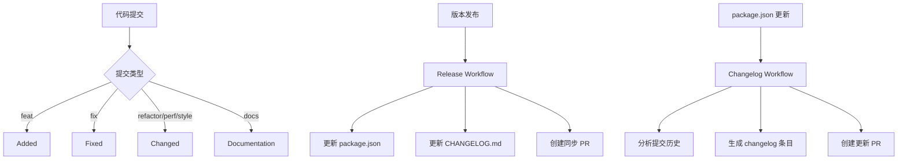

# CHANGELOG 维护指南

本项目使用 [Keep a Changelog](https://keepachangelog.com/) 格式维护变更日志。

## 自动更新

### 1. 通过 Release Workflow
当发布新版本时，release workflow 会自动：
- 检测版本不匹配
- 更新 `package.json` 版本
- 更新 `CHANGELOG.md` 文件
- 创建 PR 进行版本同步

### 2. 通过 Changelog Workflow
当 `package.json` 版本更新时，changelog workflow 会：
- 分析最近的提交
- 按类型分类变更（feat, fix, refactor, docs 等）
- 自动更新 `CHANGELOG.md`
- 创建 PR 进行 changelog 更新

### 3. 手动更新
使用 npm 脚本手动更新：

```bash
# 使用当前 package.json 版本
npm run changelog

# 指定版本
npm run changelog:version 1.0.21
```

## 提交规范

为了确保 CHANGELOG 自动更新正常工作，请遵循以下提交规范：

- `feat:` 新功能 → **Added** 部分
- `fix:` 错误修复 → **Fixed** 部分
- `refactor:` 代码重构 → **Changed** 部分
- `perf:` 性能改进 → **Changed** 部分
- `style:` 代码格式 → **Changed** 部分
- `docs:` 文档更改 → **Documentation** 部分
- `test:` 测试相关 → **Changed** 部分
- `chore:` 构建/工具 → **Changed** 部分

## 版本格式

遵循 [语义化版本](https://semver.org/) 规范：

- **Major** (X.0.0): 不兼容的 API 更改
- **Minor** (0.X.0): 向后兼容的功能添加
- **Patch** (0.0.X): 向后兼容的错误修复

## 文件结构

```
CHANGELOG.md
├── [Unreleased] - 未发布的功能
├── [1.0.21] - 2025-01-XX - 最新版本
├── [1.0.20] - 2025-01-XX - 历史版本
└── ...
```

## 工作流程



## 最佳实践

1. **及时更新**: 每次功能开发完成后及时更新 CHANGELOG
2. **详细描述**: 在提交信息中提供清晰的变更描述
3. **分类准确**: 确保提交类型与变更内容匹配
4. **版本一致**: 保持 package.json 版本与 release 标签一致
5. **审查 PR**: 定期审查和合并自动生成的 changelog PR

## 故障排除

### 常见问题

1. **CHANGELOG 未自动更新**
   - 检查提交信息格式是否符合规范
   - 确认 workflow 权限设置正确
   - 查看 workflow 运行日志

2. **版本不匹配**
   - 使用 `npm run changelog` 手动同步
   - 检查 release workflow 是否正常运行

3. **提交分类错误**
   - 手动编辑 CHANGELOG.md
   - 或重新提交使用正确的类型前缀

### 手动修复

如果自动更新出现问题，可以手动编辑 `CHANGELOG.md`：

1. 在 `[Unreleased]` 部分添加新功能
2. 在对应版本部分添加已发布的变更
3. 保持格式一致性和时间顺序

## 相关链接

- [Keep a Changelog](https://keepachangelog.com/)
- [语义化版本](https://semver.org/)
- [Conventional Commits](https://www.conventionalcommits.org/)
- [项目主页](https://github.com/HeiSir2014/git-aiflow)
